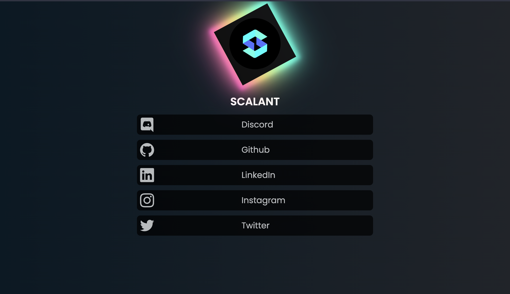

# ScalantLinkTree



A LinkTree-clone from scalant that builds a page which can be used to aggregate all the links for an organization or individual. No need to share multiple links with people, just share your links page and they'll be able to find you on any platform!!

You could host this project yourself or on any free frontend hosting provider, like - [Vercel](https://vercel.com/) or [Netlify](https://www.netlify.com/) or even GitHub Pages!


## Run locally

- [Install Node.js and npm](https://docs.npmjs.com/cli/v8/configuring-npm/install)
- [Install yarn](https://classic.yarnpkg.com/lang/en/docs/install/)
- Install dependencies-
  ```
  yarn
  ``` 
- Build the project-
  ```
  yarn run build
  ```
- Preview the project-
  ```
  yarn run preview
  ```
- You could open the application at the localhost link outputed to console!
- To have the project re-build to reflect changes as you make them, use the following command-
  ```
  yarn run dev
  ```

<!-- TODO: ADD HOST ON VERCEL BUTTON -->


## This project is open for contributions! (under [Hacktoberfest 2022](https://hacktoberfest.digitalocean.com/))
We welcome any and all contributions that add value to this project.
If you're facing an issue when trying to self-host this or setting up this project or experience a bug, feel free to [open an issue](https://https://github.com/ScalantCommunity/ScalantLinkTree/issue).
Feel free to claim an issue or open a PR, but do go through our [Contributing Guidelines](./CONTRIBUTING.md) before starting to work on anything.


